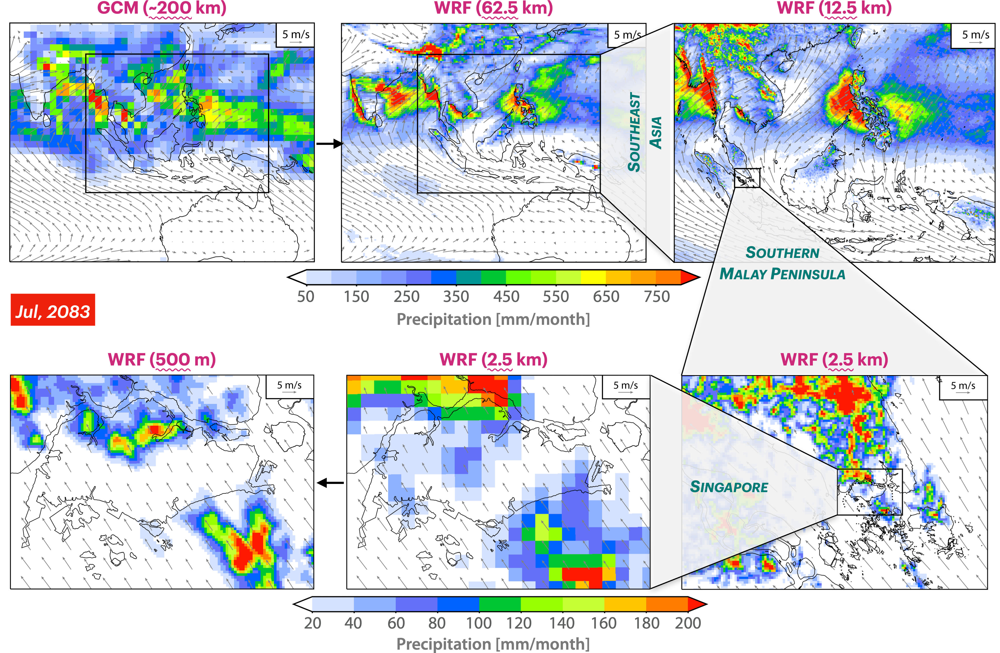
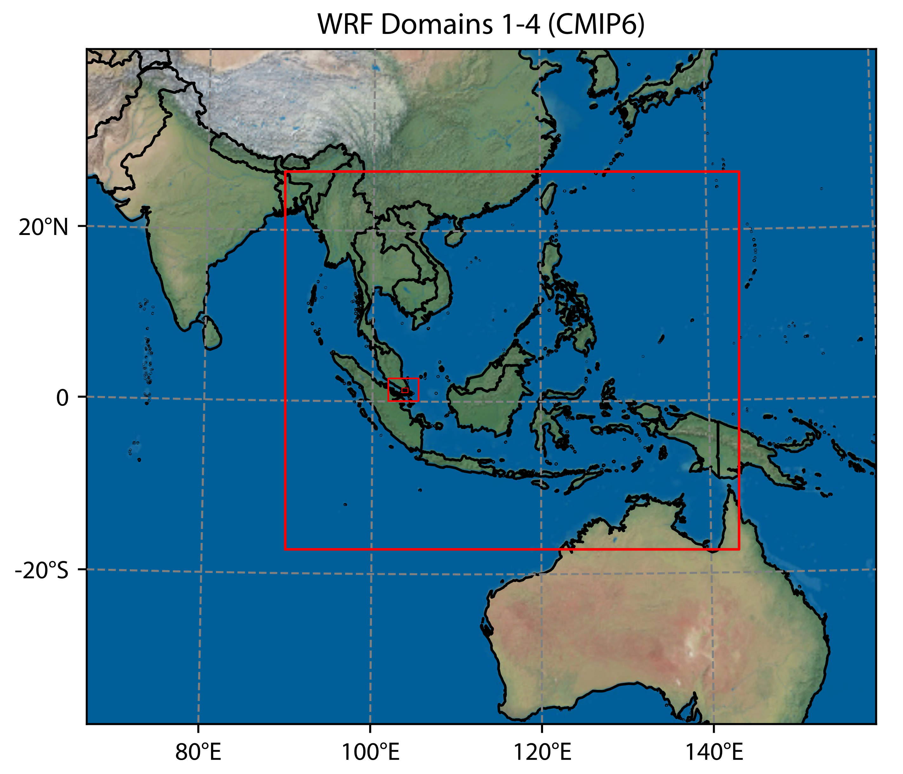

<p align="center">
  <a href="https://sgcale.github.io">
    
  </a>
</p>

<p align="center">
  <a href="https://github.com/SgCALE/SgCALE.github.io"></a>
  <a href="https://github.com/SgCALE/SgCALE.github.io"></a>
  <a href="https://github.com/SgCALE/SgCALE.github.io"></a>
  <a href="https://github.com/SgCALE/SgCALE.github.io"></a>
</p>

## Table of Contents
- [About Us](#about-us)
- [Overview](#overview)
- [Global Climate Models (GCMs)](#global-climate-models-gcms)
- [Downscaling](#downscaling)
- [Hybrid Statistical-dynamical Downscaling](#hybrid-statistical-dynamical-downscaling)
- [Resulting Dataset](#resulting-dataset)
- [Extracting Data](#extracting-data)
- [Contact Us](#contact-us)
- [Disclaimer](#disclaimer)

## About Us

SgCALE is a non-profit project that uses data and science for climate action. We aim to improve the scientific understanding of climate changes in Southeast Asia with open data. Find out more about us [here](https://sgcale.github.io/team/).

## Overview

Welcome to SgCALE (**S**in**g**apore’s **C**limate **A**rtificia**L** intelligence **E**ngine) Repository. This repository discusses the current limitations of our Global Climate Models (GCMs) and our unique approach towards climate downscaling.

Our objectives is to:

- Refine GCMs to a regional scale, enhancing their accuracy and applicability.
- Provide resources, methodologies, and scripts to advance our understanding of climate changes.

Whether you're a researcher, enthusiast, or just curious about climate science, this repository offers valuable insights and tools.

## Global Climate Models (GCMs)

### What are GCMs?

GCMs are numerical models that represent the major climate systems in the atmosphere, ocean, cryosphere, and land surface. They are critical tools for scientists to understand past, present, and future climates. GCMs under Coupled Model Intercomparison Project 6 (CMIP6) have been widely used to investigate potential climate change impacts and develop strategies to address them.

### Data Resolution

GCMs contains relatively coarse spatial resolution, often in the range of 100~300 km. While this is sufficient for global analysis, it can overlook significant regional and local variations, especially in areas with complex terrains or coastlines. For instance, a GCM might not accurately capture the microclimates found in mountainous regions or small islands, such as Singapore.

## Downscaling

To make GCM outputs relevant at local to regional scales, downscaling is employed. Downscaling is the process of taking coarse-resolution GCM outputs and refining them to provide high-resolution climate projections.

### Statistical Downscaling

This method involves establishing statistical relationships between the large-scale atmospheric data from GCMs and local-scale climate computations. Once these relationships are determined based on historical data, they can be used for future projections to predict local future climates.

### Dynamical Downscaling

This method uses the outputs from GCMs as boundary conditions for regional climate models (RCMs) that have a much higher spatial resolution. RCMs, like GCMs, are based on the physical equations governing atmospheric flow but focus on a specific region. The advantage is that they can capture regional and local processes more accurately. However, they also inherit biases from the parent GCM and might introduce their own biases.

## Hybrid Statistical-dynamical Downscaling

Drawing inspiration from the methods of [Xu et al. (2021)](https://pubmed.ncbi.nlm.nih.gov/34737356/), we've integrated both statistical and dynamical downscaling techniques to enhance the precision of our resulting dataset.

### Methodology

1. Establish a bias-corrected and downscaled dataset based on 14 CMIP6 GCMs and the European Centre for Medium-Range Weather Forecasts Reanalysis 5 (ERA5) dataset.

2. Adjusted the bias-corrected dataset to align with climate patterns of ERA5 and integrated non-linear trend observed from the 14 CMIP6 models.

3. Resulting dataset spans a historical period of 1979–2014 and future scenarios (SSP585) of 2015–2100, with a temporal scale of six-hour.

### Key Features

<p align="center">
  
</p>

High Data Resolutions

- Southeast Asia at 12.5km resolution
- Southern Malay Peninsula at 2.5km resolution
- Singapore at 500m resolution

Enhanced Accuracy

- Better ability to reproduce regional climate extremes and spatial patterns than existing dynamical scaling work (e.g., CORDEX) in Southeast Asia.

## Resulting Dataset

<p align=center>
  
</p>

Features of the resulting open-source and high-resolution dataset:

- Output files are in daily netCDF format with equal area projection at three domains (12.5km: Southeast Asia; 2.5km: Southern Malay Peninsula; 500m: Singapore).

- Variables include temperature, precipitation, wind speed, relative humidity, and solar radiation.

- Each daily file has 8 timesteps (0,3,6,9,12,15,18,21 ; or 3,6,9,12,15,18,21,0).
  - Due to occasional restarts, there are one or more files named by the same day.
  - 7 timesteps in the last *_00:00:00 file are the same with the first*_03:00:00 file.
  - We can merge the first timestep of our target \*_00:00:00 file with the first 7 timesteps of the \*_03:00:00 file using Xarray.

## Extracting Data

The following Python (v3.8) script can be used to extract the resulting dataset from the Network Attached Storage (NAS) to your local machine.

```python
import xarray as xr #v2022.3.0 
import salem 
import datetime

# Extract WRF variables from NAS; ensure the NAS is mounted.
# Download the code to your local machine and run in a local directory.
for yr in range(1981,2020):
  print(yr)
  dirwrf='/mnt/y/WRF_3domain_fERA5/d02/'+str(yr)+'/'
  ds=xr.open_mfdataset(dirwrf+'wrfout_d02_*',concat_dim='Time',combine='nested')
  # odir is the local dir for saving out data, './' means present folder
  odir='./'
  # RAINNC is the var name, you can change this to your requirement;
  # the whole output vars is in wrfout.vars_list.txt
  ds.RAINNC.to_netcdf(odir+'RAINNC.'+str(yr)+'.nc')
  # you can also use salem.deacc to de-accumulate the variables(RAINC RAINNC)
  # df=ds.RAINNC.salem.deacc(as_rate=False)
  # df.to_netcdf(odir+'RAINNC.'+str(yr)+'.nc')
  time = datetime.datetime.now().strftime('%Y-%m-%d %H:%M:%S')
  print(time)
```

## Contact Us

If you have any questions, comments, or suggestions that aren't suitable for public discussions in the Issues section, please feel free to reach out to [Xiaogang He](mailto:hexg@u.nus.edu).

Please use the GitHub Issues for public discussions related to bugs, enhancements, or other project-related discussions.

## Disclaimer

The information provided in this repository is for general informational purposes only. While we strive for accuracy, we make no guarantees regarding the completeness, reliability, or accuracy of the content. Any reliance on this information is strictly at the user's own risk. We are not responsible for any decisions made based on the data here, nor for the content or practices of any external links provided. It's recommended to cross-reference with other sources and consult professionals before making any decisions.
